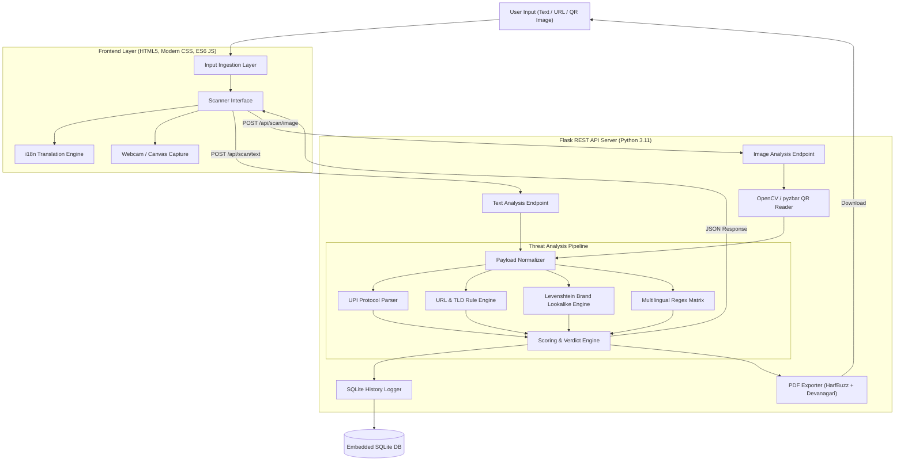

# 🛡️ ScamShield — Mobile, Cloud & IoT Cyber Security Suite

[](https://python.org)
[](https://flask.palletsprojects.com/)
[](tests/)
[](LICENSE)
[](core/export_pdf.py)

---

## 👥 Project Team & Academic Credits

- **Course:** B.Sc.-IT(Hons.) Sem 5 — Cyber Security in Mobile, Cloud and IoT
- **Developers:**
  - **Jaivin Vachhani** (Enrollment: `2405101200043`)
  - **Yash Jadhav** (Enrollment: `2405101200015`)
  - **Tirth Bariya** (Enrollment: `2405101200050`)

---

## 📌 Executive Summary

**ScamShield** is an offline, privacy-first cybersecurity utility designed to detect and demystify mobile phishing (smishing), fraudulent web links, malicious QR codes (quishing), and UPI payment collection scams targeting Indian digital consumers.

Unlike cloud-based antivirus scanners that send your personal messages and private banking communications to third-party remote servers, **ScamShield analyzes everything 100% locally on your machine**. Nothing you paste or scan ever leaves your computer.

---

## 🚀 Key Features

### 1. 🔍 Multi-Modal Scam Detection Engine
- **SMS & WhatsApp Smishing**: Evaluates message urgency, threatening language, fake bank KYC warnings, lottery/jackpot lures, refund scams, and credential harvest requests across **English**, **Hindi (हिंदी)**, and **Hinglish**.
- **Link & Phishing Defense**: Unmasks deceptive URL shorteners, raw IP host URLs, dangerous top-level domains (`.xyz`, `.top`, `.click`), credential-stealing `@` syntax, and punycode obfuscation.
- **Brand Lookalike / Typosquatting Classifier**: Utilizes C-accelerated Levenshtein distance metrics to detect lookalike domains imitating major Indian banks, e-commerce giants, and payment apps (e.g., `paytrn.com` vs `paytm.com`, `sbi-kyc-update.xyz` vs `sbi.co.in`).
- **QR Code (Quishing) Analyzer**: Decodes QR code images via OpenCV and pyzbar, analyzing the encapsulated payload.
- **UPI Fraud Prevention**: Parses RFC UPI payment URIs (`upi://pay`), alerts users if a prefilled payment amount exists, and warns against the common **"Scan QR to receive money"** reverse-charge scam.

### 2. 🌐 Complete Bilingual Support (English & Hindi)
- Fully localized user interface with instant client-side language switching.
- **24 Educational "Learn Why" Cards** providing plain-language cyber literacy advice for every single threat flag identified by the analyzer.
- **Bilingual PDF Report Exporter**: Uses `fpdf2` coupled with `uharfbuzz` text shaping and bundled Google Noto Sans Devanagari font for complex Hindi rendering (no broken conjuncts or disjointed matras).

### 3. 🎨 Dark Glassmorphism Frontend UI
- Modern, responsive web interface built with pure CSS custom design tokens (no bulky node_modules or bloated CSS frameworks).
- Tabbed interface supporting text paste, link scan, drag-and-drop image upload, and live webcam scanner.
- Animated circular SVG risk score gauge (0–100) and severity verdict banners (Safe, Suspicious, Dangerous).
- Word-level highlight reconstruction mapping detected threat spans with color-coded category legends.

### 4. 🗄️ Privacy-Preserving History Log
- Local SQLite database operating in **Write-Ahead Logging (WAL)** mode for high-concurrency read/write operations.
- Privacy-conscious preview truncation (stores only the first 60 characters).
- Filter by verdict, input type, or date.
- Defense-in-depth SQL injection protection via strictly parameterized queries.

---

## 🏗️ System Architecture



---

## 📂 Project Directory Structure

```text
ScamShield/
├── app.py                      # Flask web application & REST API routes
├── requirements.txt            # Python production dependencies
├── scamshield.db               # SQLite local database (auto-initialized)
│
├── core/                       # Core analysis engine
│   ├── analyzer.py             # Unified analysis pipeline coordinator
│   ├── message_rules.py        # Regex matrices for smishing & keywords
│   ├── url_rules.py            # URL heuristics, TLD, IP host checks
│   ├── lookalike.py            # Levenshtein distance brand protection
│   ├── upi_parser.py           # UPI URI parser & reverse-charge detector
│   ├── qr_reader.py            # QR code image extraction (OpenCV / pyzbar)
│   ├── scoring.py              # Risk scoring (0-100) & verdict aggregator
│   ├── history.py              # SQLite CRUD, stats, and query sanitization
│   └── export_pdf.py           # Bilingual PDF generator (fpdf2 + uharfbuzz)
│
├── data/                       # Threat data dictionaries & samples
│   ├── brands.json             # Monitored Indian brands and legitimate domains
│   ├── keywords_en.json        # English scam keyword patterns
│   ├── keywords_hi.json        # Hindi Devanagari scam keyword patterns
│   ├── keywords_hinglish.json  # Hinglish transliterated keyword patterns
│   ├── shorteners.json         # Known URL shortening services
│   └── samples.json            # 15 pre-built safe & scam sample inputs
│
├── i18n/                       # Localization & educational cards
│   ├── en.json                 # English UI dictionary (105 keys)
│   ├── hi.json                 # Hindi UI dictionary (105 keys, 1:1 parity)
│   ├── learn_en.json           # 24 educational threat cards (English)
│   └── learn_hi.json           # 24 educational threat cards (Hindi)
│
├── templates/                  # Jinja2 HTML templates
│   ├── base.html               # Base layout, navbar, footer, toast container
│   ├── index.html              # Main scanner page (tabs, results, gauge)
│   ├── history.html            # Scan history table & statistics
│   ├── learn.html              # Searchable educational knowledge base
│   └── about.html              # Project context, workflow, team credits
│
├── static/                     # Frontend static assets
│   ├── css/
│   │   └── style.css           # Glassmorphism dark design system
│   ├── js/
│   │   ├── i18n.js             # Client-side translation engine
│   │   ├── main.js             # Mobile nav, toasts, modal dialog helpers
│   │   ├── scanner.js          # Scanner logic, camera stream, PDF trigger
│   │   ├── history.js          # History data table & stats management
│   │   └── learn.js            # Search filtering & hash anchor navigation
│   └── fonts/
│       └── NotoSansDevanagari-Regular.ttf # Bundled Devanagari font
│
├── docs/                       # Comprehensive documentation
│   ├── PRD.md                  # Product Requirements Document
│   ├── ARCHITECTURE.md         # Detailed architectural breakdown
│   └── TECH_STACK.md           # Technology rationale & implementation
│
└── tests/                      # Pytest automated test suite
    ├── test_analyzer.py        # Core engine & 30-case validation suite
    ├── test_history.py         # SQLite CRUD, stats, SQL injection tests
    ├── test_i18n_pdf.py        # Key parity, learn card coverage, PDF tests
    ├── test_frontend.py        # Template rendering & static asset tests
    └── test_docs.py            # Documentation completeness test
```

---

## ⚙️ Installation & Setup

### Prerequisites
- **Python 3.11** or higher
- Git

### 1. Clone the Repository
```bash
git clone https://github.com/GhostX1407/ScamShield.git
cd ScamShield
```

### 2. Create and Activate Virtual Environment
```bash
# Windows (PowerShell)
python -m venv venv
.\venv\Scripts\Activate.ps1

# Linux / macOS
python3 -m venv venv
source venv/bin/activate
```

### 3. Install Dependencies
```bash
pip install -r requirements.txt
```

### 4. Run the Application
```bash
python app.py
```
Open your web browser and navigate to:  
👉 **`http://127.0.0.1:5000`**

---

## 🧪 Running Automated Tests

ScamShield includes an exhaustive test suite covering unit tests, integration tests, SQL injection immunity, i18n parity, and PDF rendering:

```bash
# Run all tests
pytest tests/ -v

# Run with execution summary
pytest tests/ -v --tb=short
```

Expected output:
```text
============================= 173 passed in ~5s =============================
```

---

## 📡 REST API Reference

| Endpoint | Method | Description | Request Body / Query |
|---|---|---|---|
| `/api/scan/text` | `POST` | Scan SMS, message, URL, or UPI string | `{"text": "string"}` |
| `/api/scan/image` | `POST` | Scan uploaded QR code image | `multipart/form-data` with `image` file |
| `/api/history` | `GET` | Retrieve logged scans | Query params: `verdict`, `type`, `date` |
| `/api/history/<id>` | `DELETE` | Delete single history record | URL parameter `id` |
| `/api/history` | `DELETE` | Delete all history records | None |
| `/api/history/stats` | `GET` | Aggregate scan statistics | None |
| `/api/i18n/<lang>` | `GET` | Fetch UI translations (`en` or `hi`) | URL parameter `lang` |
| `/api/learn/<lang>` | `GET` | Fetch all 24 educational threat cards | URL parameter `lang` |
| `/api/samples` | `GET` | Fetch preset test samples | None |
| `/api/export/pdf` | `POST` | Generate bilingual PDF report | `{"lang": "en"\|"hi", "result": {...}}` |
| `/health` | `GET` | Service liveness health check | None |

---

## 🔒 Security & Privacy Guarantee

- **Zero Network Egress**: The detection engine performs strictly local computations. No user input or metadata is transmitted across the internet.
- **Privacy Preservation**: The SQLite history table records at most the first 60 characters of any scanned content (`preview_text[:60]`). Full message contents and contact details are never stored.
- **SQL Injection Resistance**: All database queries are executed using parameterized SQL statements (`?` placeholders). No user string is ever interpolated directly into SQL syntax.
- **Safe Link Handling**: ScamShield inspects the syntactic and morphological properties of URLs. It **never fetches or executes** the target webpage, eliminating drive-by download risks.
