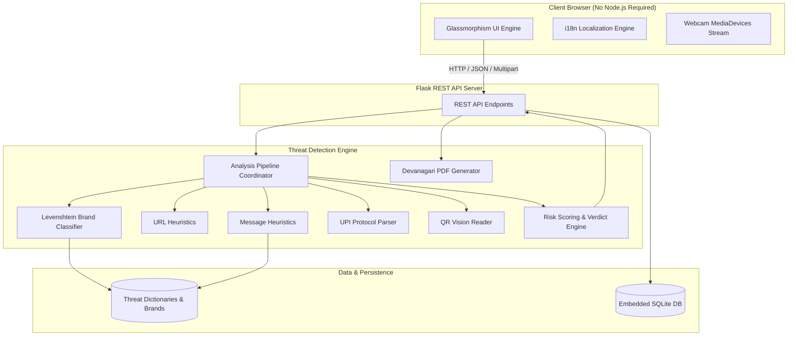

# System Architecture Document — ScamShield

**Document Version:** 1.0  
**Project:** ScamShield  
**Course:** B.Sc.-IT(Hons.) Semester 5 — Cyber Security in Mobile, Cloud and IoT  
**Authors:** Jaivin Vachhani (`2405101200043`), Yash Jadhav (`2405101200015`), Tirth Bariya (`2405101200050`)  
**Status:** Approved & Complete  

---

## 1. Architectural Overview

ScamShield is engineered following a clean, modular multi-tier architectural pattern. The system consists of:
1. **Presentation Tier (Client Frontend)**: Lightweight Vanilla HTML5, CSS3, and ES6 JavaScript utilizing a custom design token system and glassmorphism styling.
2. **Application Tier (Flask Controller & REST API)**: Python-based microframework handling request validation, routing, file upload processing, and response serialization.
3. **Domain Engine Tier (Analysis Pipeline & Detection Heuristics)**: Decoupled Python modules implementing deterministic regular expressions, string distance algorithms, URL morphologic heuristics, and QR computer vision decoding.
4. **Data & Persistence Tier**: An embedded SQLite relational database running in Write-Ahead Logging (WAL) mode for local audit logging and statistics aggregation.



---

## 2. Pipeline Data Flow

When a user initiates a scan, the payload undergoes sequential normalization, extraction, threat scanning, scoring, and persistence:

```text
[ Raw Input ] (Text / URL / Image File)
      │
      ▼
[ Step 1: Ingestion & Validation ]
      ├─ If Image: OpenCV / pyzbar extracts encapsulated text string
      └─ Length checked (≤ 10,000 chars), MIME validated
      │
      ▼
[ Step 2: Content Normalization & Routing ]
      ├─ Detect payload category: UPI Protocol / Pure URL / Generic Message
      └─ Extract embedded URLs via regex URL pattern
      │
      ▼
[ Step 3: Concurrent Heuristic Scanners ]
      ├── 3A: UPI Parser -> Checks scheme `upi://pay`, extract `pa`, `am`, flags prefilled demand
      ├── 3B: URL Rule Engine -> TLD checks (.xyz, .top), shorteners, IP host, @ auth bypass
      ├── 3C: Brand Lookalike -> RapidFuzz Levenshtein edit distance & homoglyphs against brands.json
      └── 3D: Message Rule Engine -> RegEx evaluation across 7 semantic categories (EN/HI/Hinglish)
      │
      ▼
[ Step 4: Scoring Aggregator & Normalizer ]
      ├─ Sum weighted category scores (Urgency, Money, KYC, Prize, etc.)
      ├─ Clamp risk score to [0, 100]
      └─ Assign verdict: Safe (0-29) | Suspicious (30-59) | Dangerous (60-100)
      │
      ▼
[ Step 5: Persistence & Response ]
      ├─ Save truncated preview (≤ 60 chars), score, verdict to SQLite
      └─ Return structured JSON payload to client (highlights, flags, upi_details)
```

---

## 3. Subsystem Specifications

### 3.1 Unified Analysis Coordinator (`core/analyzer.py`)
- Coordinates the execution of sub-analyzers based on the input type.
- Ensures URLs found within message bodies are automatically routed through both the `url_rules.py` heuristics and the `lookalike.py` brand detection modules.
- Returns a normalized dictionary containing: `type`, `score`, `verdict`, `flags`, `highlights`, `urls`, and `upi_details`.

### 3.2 Message Rules & Multilingual Regex Matrix (`core/message_rules.py`)
- Compiles regex patterns with word boundary markers (`\b`) to eliminate false positives in substrings.
- Evaluates 7 distinct psychological triggers:
  1. Urgency (`urgency`)
  2. Money demands (`money`)
  3. KYC / Account block (`kyc`)
  4. Prize / Lottery (`prize`)
  5. Refund / Cashback (`refund`)
  6. Threats / Legal action (`threats`)
  7. Personal credentials harvest (`personal_info`)
- Supports tri-lingual datasets loaded from JSON: English (`data/keywords_en.json`), Hindi Devanagari (`data/keywords_hi.json`), and Hinglish transliterated patterns (`data/keywords_hinglish.json`).
- Tracks match character spans (`start`, `end`, `category`, `word`) for frontend highlight reconstruction.

### 3.3 Brand Lookalike & Typosquatting Engine (`core/lookalike.py`)
- Employs **RapidFuzz** (C++ accelerated Levenshtein distance) to compare extracted domains against trusted brand names in `data/brands.json` (e.g., SBI, HDFC, ICICI, Paytm, PhonePe, Amazon).
- Identifies typosquatting domains with an edit distance ≤ 2 while excluding official whitelisted domains.
- Performs homoglyph and character substitution checks (e.g., replacing `rn` with `m`, `0` with `o`, `1` with `l`).

### 3.4 URL Rules & Heuristic Engine (`core/url_rules.py`)
- Utilizes `tldextract` for accurate Public Suffix List (PSL) domain and TLD extraction.
- Checks:
  - Suspicious TLDs: `.xyz`, `.top`, `.click`, `.club`, `.work`, `.link`, `.online`, etc.
  - URL shorteners: `bit.ly`, `tinyurl.com`, `is.gd`, `t.co`, etc.
  - IP Address Hosts: Raw IPv4 addresses in hostname positions.
  - Userinfo credential spoofing: `@` symbol in URL authorities.
  - Dangerous path and query keywords: `login`, `verify`, `kyc`, `update`, `banking`.

### 3.5 QR Code Vision Reader (`core/qr_reader.py`)
- Multi-engine decoding pipeline:
  1. Primary: OpenCV `cv2.QRCodeDetector` optimized for fast real-time frame scanning.
  2. Fallback: `pyzbar` for damaged, rotated, or low-contrast QR codes.
- Supports both static file uploads (JPEG, PNG, WebP) and live canvas snapshots streamed from client webcams.

### 3.6 UPI Payment Protocol Parser (`core/upi_parser.py`)
- Parses RFC-compliant URI syntax conforming to NPCI UPI specifications (`upi://pay?...`).
- Extracts query parameters:
  - `pa`: Payee Virtual Payment Address (VPA)
  - `pn`: Payee display name
  - `am`: Transaction amount
  - `tn`: Transaction note / description
- Heuristic checks:
  - Prefilled amount detection: Flags incoming QR codes that demand automated payment execution.
  - Social engineering note detection: Flags notes containing "cashback", "refund", "prize", or "lottery".
  - Reverse-charge warning: Issues critical educational alert that QR codes can only *send* money, never *receive* funds.

### 3.7 Devanagari Text Shaping & PDF Generator (`core/export_pdf.py`)
- Uses `fpdf2` for programmatic vector PDF document construction.
- Integrates `uharfbuzz` (Python bindings for HarfBuzz) to perform OpenType complex text shaping for Devanagari script.
- Resolves font glyph clusters, conjunct ligatures, and reordering of dependent vowel signs (*matras*) using the bundled Google `NotoSansDevanagari-Regular.ttf` font.

### 3.8 Local History & Storage Engine (`core/history.py`)
- SQLite3 embedded database (`scamshield.db`) initialized automatically on startup.
- Configured with `PRAGMA journal_mode = WAL` (Write-Ahead Logging) and `PRAGMA synchronous = NORMAL` for high concurrency and crash resilience.
- Indexes:
  - `idx_scans_verdict` on `scans(verdict)`
  - `idx_scans_input_type` on `scans(input_type)`
  - `idx_scans_timestamp` on `scans(timestamp)`
- Defense-in-depth: Strict parameterization (`?` placeholders) guarantees 100% immunity against SQL injection attacks.

---

## 4. Database Schema

```sql
CREATE TABLE IF NOT EXISTS scans (
    id          INTEGER PRIMARY KEY AUTOINCREMENT,
    timestamp   TEXT NOT NULL,
    input_type  TEXT NOT NULL,
    preview     TEXT NOT NULL,
    verdict     TEXT NOT NULL,
    score       INTEGER NOT NULL,
    flags_json  TEXT NOT NULL
);

CREATE INDEX IF NOT EXISTS idx_scans_verdict    ON scans (verdict);
CREATE INDEX IF NOT EXISTS idx_scans_input_type ON scans (input_type);
CREATE INDEX IF NOT EXISTS idx_scans_timestamp  ON scans (timestamp);
```

---

## 5. Security & Privacy Model

1. **Air-Gap Architecture**: The application opens zero outbound network sockets. Target URLs are analyzed via lexical and morphological grammar rules; they are **never requested or resolved over HTTP/HTTPS**.
2. **Data Minimization Principle**: The local database retains only the first 60 characters of any scanned message or URL (`preview = text[:60]`). Full user messages, personal names, phone numbers, or account details are discarded immediately following analysis.
3. **No External Frontend CDNs**: All stylesheets, JavaScript files, and font binaries (`NotoSansDevanagari-Regular.ttf`) are bundled locally within `static/`, preventing user tracking via third-party CDN scripts.
4. **Input Size & File Restrictions**:
   - Text inputs capped at 10,000 characters to prevent ReDoS (Regular Expression Denial of Service).
   - Image uploads limited to 5 MB with strict MIME validation (`image/jpeg`, `image/png`, `image/webp`).
